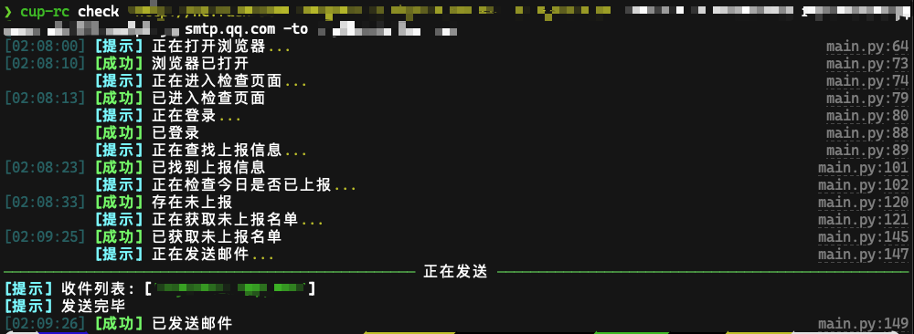

<h1 style="text-align: center"> ReportCheck </h1>

## 安装

```shell
pip3 install https://github.com/Rhythmicc/ReportCheck.git -U
```

## 使用

```shell
cup-rc --help

cup-rc [--press] remote_url username password fr email_password smtp -to to1 to2 ...
```

### 参数表

| 参数           | 类型   | 描述                                  |
| -------------- | ------ | ------------------------------------- |
| remote_url     | 字符串 | 远程浏览器地址 Remote browser address |
| username       | 字符串 | 学号/工号 Username                    |
| password       | 字符串 | 密码 Password                         |
| fr             | 字符串 | 发件人邮箱 From email                 |
| email_password | 字符串 | 发件人邮箱密码 From email password    |
| smtp           | 字符串 | SMTP 服务器 SMTP server               |
| to             | 列表   | 收件人邮箱列表 To email list          |
| press          | 布尔   | 是否催报 Whether to press             |

### 样例


